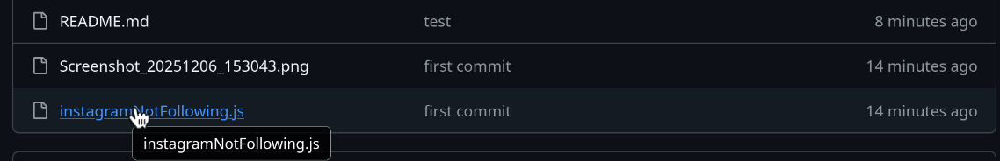
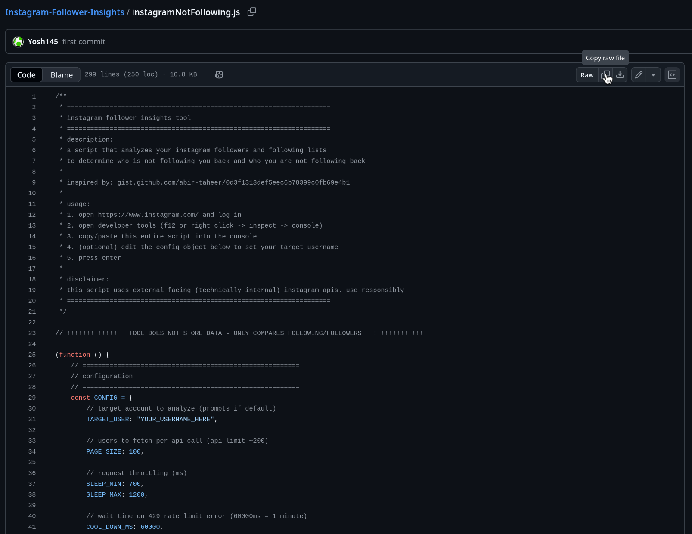
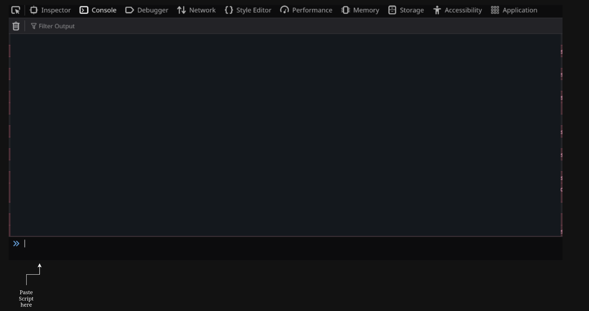

# Instagram Helper (Instagram Follower Insights)

A browser-based tool to analyze your Instagram connections. This script runs entirely in your browser console to compare your **Followers** vs. **Following** lists, identifying who isn't following you back and who you aren't following back.

> **Read:** Instagram will say STOP when you open the console. This tool operates entirely on the client side. No data is sent to external servers. Everything happens within your browser's memory. You can close the browser once finished.

## Usage

1. Click on `instagramNotFollowing.js`



2. Click copy raw file


3.  **Log in** to your account on [instagram.com](https://www.instagram.com).

4.  Open the **Developer Tools**:
      * Windows/Linux: `F12` or `Ctrl + Shift + J`
      * Mac: `Cmd + Option + J`

5.  Navigate to the **Console** tab.

6.  **Copy and Paste** the entire script into the console.


7.  **Press Enter**.
      * *If you did not edit the username in the script, a prompt will appear asking for the target username.*

8.  Wait for the analysis to complete. Do not close the tab.

9. Console will clear when finished, and output the THESE ACCOUNTS DO NOT FOLLOW YOU BACK and YOU DO NOT FOLLOW BACK THESE ACCOUNTS

## Features

  * **Concurrent Fetching:** Fetches "Followers" and "Following" lists simultaneously for faster execution.
  * **Smart Rate Limiting:** Automatically detects Instagram's `429 Too Many Requests` errors and enters a "Cool Down" mode (pauses for 60s) before resuming, preventing account locks.
  * **Memory Optimized:** Stores only essential data (ID, username, verified status) using `Map` structures to handle large accounts without crashing the browser.
  * **Clean Output:** Displays results in sortable, interactive tables using `console.table`.

## Prerequisites

  * A desktop web browser (Chrome, Edge, Firefox, Brave, etc.).
  * An active session on [instagram.com](https://www.instagram.com).

## API Reference

Once the script is loaded, the `IGHelper` object is exposed globally. You can use the following commands in the console:

### `IGHelper.run(username)`

Manually triggers the analysis for a specific user.

```javascript
IGHelper.run('YOUR_USER_HERE');
```

### Accessing Raw Data

You can access the raw data arrays in the console after a run:

```javascript
// Filter for verified users who don't follow you back
IGHelper.lastResult.notFollowingBack.filter(u => u.verified);
```

## Configuration

You can tweak the constants at the top of the script to adjust speed and safety.

| Constant | Default | Description |
| :--- | :--- | :--- |
| `PAGE_SIZE` | `100` | Number of users to fetch per API request (Max \~200). |
| `SLEEP_MIN` | `700` | Minimum delay (ms) between requests. |
| `SLEEP_MAX` | `1200` | Maximum delay (ms) between requests. |
| `COOL_DOWN_MS` | `60000` | Time to wait (ms) if a 429 Rate Limit error occurs. |

## Disclaimer & Safety

  * **Use at your own risk.** This script uses Instagram's internal web APIs. While it implements safety measures (random delays and rate-limit handling), excessive use may trigger temporary blocks or account restrictions.
  * **Do not spam.** Run this script sparingly (once a week). Running it multiple times in rapid succession is the fastest way to get flagged.
  * **Privacy:** This script is open source and runs locally. No credentials or user data are transmitted to the developer or any third parties.

## Troubleshooting
  * **Script stops immediately?**
    Ensure you are on the main `https://www.instagram.com` page and not in a sub-frame. Refresh the page and try again.
  * **429 Errors (Pink Warnings):**
    This is normal for larger accounts. The script will automatically pause for 60 seconds and retry. **Do not close the tab**; just let it wait.
  * **401 Errors:**
    Your session may have expired. Refresh the page, log out and log back in, and run the script again.

-----

*This project is not affiliated with, authorized, maintained, sponsored, or endorsed by Instagram, Meta, or any of its affiliates or subsidiaries.*